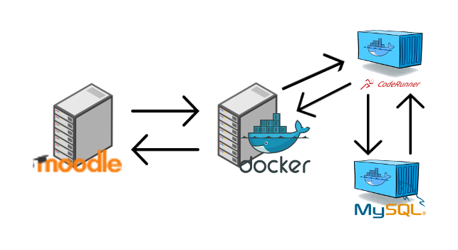
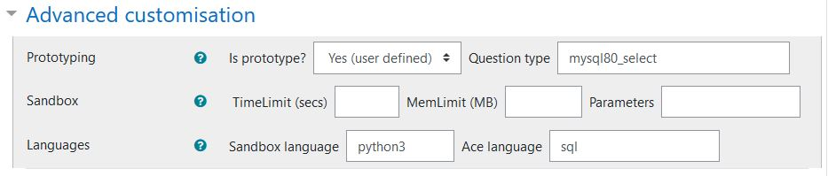
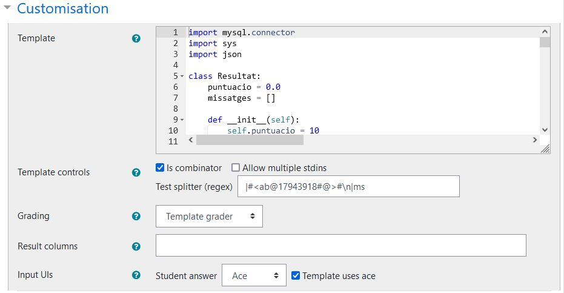
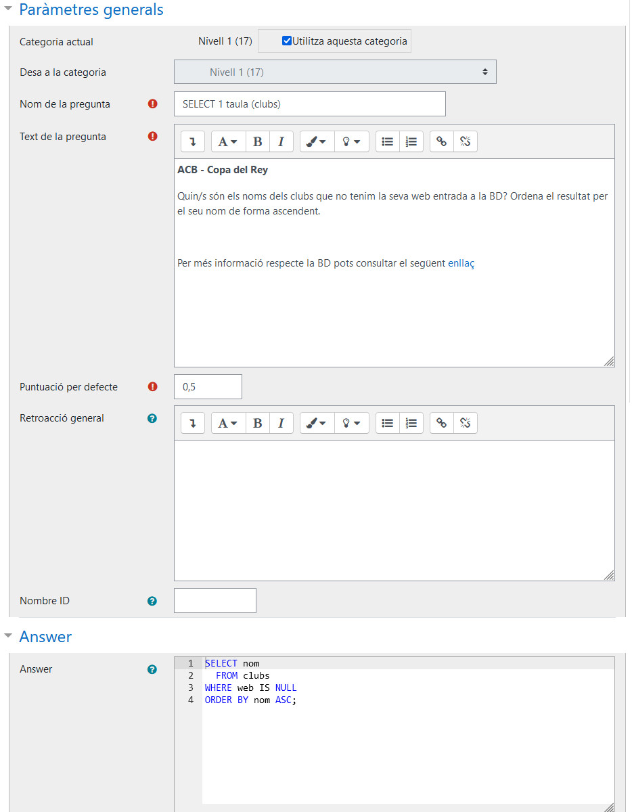

# CodeRunner

## Introducció
Aquesta documentació correspon a la configuració del [plugin CodeRunner](https://moodle.org/plugins/qtype_coderunner) destinat el LMS Moodle i desenvolupat per [Richard Lobb]([https://coderunner.org.nz/), professor de la Universitat de Canterbury de Nova Zelanda.
Aquest plugin permet crear un tipus de pregunta dins els qüestionaris de Moodle que l'estudiant pot respondre mitjançant codi i que s'autocorregeixen mitjançant la seva execució en un Sandbox. Això permet al professor preparar preguntes autocorregibles per l'estudiant i aquest pugui practicar de manera autònoma.

La configuració aquí explicada correspon a un escenari d'autocrrecció d'exercicis SQL mitjançant el SGBDR MySQL. Concretament la versió 8.0

Recursos:
- [Pàgina oficial CodeRunner](https://coderunner.org.nz/)
- [YouTube CodeRunner](https://www.youtube.com/channel/UCDRXp0D9QLBJWxkzjcHTJgA)

## Infraestructura

La infraestructura de com està muntada aquest configuració és la mostrada a la imatge.
Tenim dues màquines. En una hi tenim el Moodle i a l'altre i tenim el servei de Docker amb dos contenidor. Un el [JobeServer de CodeRunner](https://hub.docker.com/r/trampgeek/jobeinabox/) i l'altre el MySQL, concretament el [Percona Server 8.0](https://hub.docker.com/_/percona)


El fet de tenir el JobeServer i el PerconaServer dins de contenidors és una opció personal, però es podrien tenir en màquines diferents.

## Apartat *CodeRunner Question Type*

S'ha creat una *CodeRunner Question Type* personalitzada (custom) com a plantilla anomenada **mysql80_select** per tal de que totes les preguntes de tipus CodeRunner que vulguem que utilitzin el SGBDR Persona Server 8.0 heredin d'aquesta pregunta.

A l'apartat *Advanced customisation* definim que és una pregunta de tipus plantilla, li donem un nom al tipus de pregunta i indiquem que el llenguatge amb el qual s'executarà serà python3 i que el llenguatge que ha d'interpretar la caixa de text a on l'alumne respondrà serà SQL.


## Apartat Paràmetres generals
Els paràmetres generals els aprofitem per posar nom a la pregunta. En aquest cas posem: **"PROTOTYPE_MYSQL80_SELECT"**. Posem el prefix PROTOTYPE per indicar/identificar que aquesta pregunta no es pot utilitzar en dins d'un qüestionari i que és especial quan es visualitza dins del banc de preguntes.

En el camp **Text de la pregunta** hi ha tota la informació de pràmetres que podem utilitzar en les preguntes que derivin de la plantilla. És una mena de documentació interna.

Parèmtres de connexió:
- mysqlhost: Host de la màquina a on hi ha la BD
- mysqluser: Usuari
- mysqlpwd: Contrasenya
- mysqldb: Nom de la bd que ens volem connectar 

Paràmetre checks: array a on hi haurà quines comprovacions/CHECK's s'hauran de realitzar:
- CHECK_NUM_ROWS: Comprova el número de files retornades
- CHECK_NUM_FIELDS: Comprova el número de camps retornats
- CHECK_NAME_FIELDS: Comprova el nom dels camps retornats
- CHECK_ORDER_NAME_FIELDS (no implementat): Comprova l'ordre dels camps retornats
- CHECK_EFFICIENCY(no implementat): Comprova l'eficiència mitjançant EXPLAIN

Altres paràmetres:
- percent_checks: (0.25) Valor que tindran els checks respecte el total de la pregunta. Ja que en principi hi ha un check automàtic que és comprovar el resultat de la sentència SELECT. Aquest percentatge es repartirà de manera equitativa dels diferents checks que hi hagi al paràmetre checks
- show_checks:  (true/false): Mostra a l'usuari el resultat de cada check.


Exemple:
{
"mysqlhost":"<IP>"
,"mysqluser":"<USUARI>"
,"mysqlpwd":"<PARAULA DE PAS>"
,"mysqldb":"<BASE DE DADES>"
,"checks":["CHECK_NUM_ROWS","CHECK_NUM_FIELDS","CHECK_NAME_FIELDS","CHECK_ORDER_NAME_FIELDS","CHECK_ORDER_BY","CHECK_EFFICIENCY"]
,"percent_checks":0.25
}

## Apartat *Customisation*

En aquest apartat, concretament en el paràmetre **Template** hi haurà el codi que s'executarà per comprovar la resposta de l'alumne. En aquest cas el codi està fet en Python.

[Codi font complet](src-template-mysql80_select-questiontype.py)

L'estructura del codi és molt simple i millorable.

Declarem una classe anomenada Resultat que l'utilitzarem per anar-hi guardant tot el que va passant en les diferents comprovacions/checks i és la que utilitzarem al final per construir la resposta al'usuari.

``` Python
class Resultat:
    puntuacio = 0.0
    missatges = []

    def __init__(self):
        self.puntuacio = 10
        self.missatges = [['Test', 'Comment', 'IsCorrect']]
```

El pseudocodi de l'algorisme és el següent:

Connexió a la BD
Preparem l'entorn i la variable de Retorn
Executem la sentència de l'estudiant
Comencem a realitzar les comprovacions segons el paràmetre checks (QUESTION.parametres.checks)





## Exemple d'una pregunta

A continuació es mostra un exemple d'una pregunta.
En aquest cas els paràmetres que s'han modificat són el *mysqldb*


En l'apartat dels paràmetres generals és a on es col·loca l'enunciat de la pregunta i la solució.



